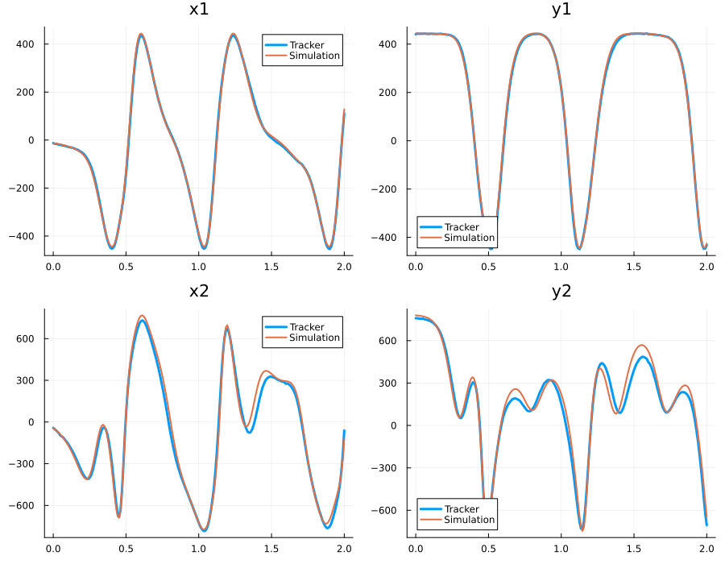
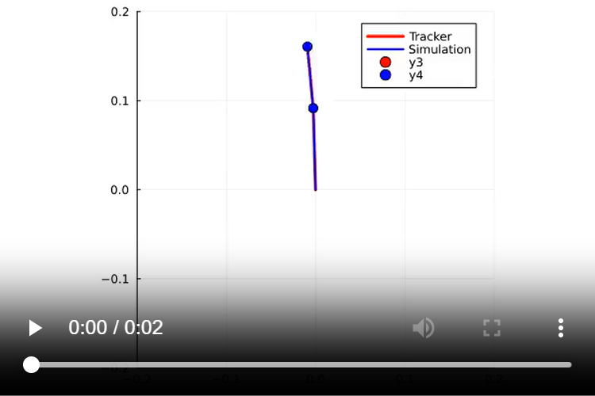

# PendulePhysic

```
📁 PendulePhysic
├── 📁 doc         
│    ├──📄CPI_ProjetPendule.pdf     #Assignment
│    └──📄doc.md                    #Some doc

├── 📁 src
│    ├──📁 Other                    #Other sim
│    ├──📄 data.csv                 #Data from tracker
│    └──📄 Double_pendule.jl        #Double pendule
│
├── 📁 tracker
│    └──📄 physique_tracker.trk     #Tracker 
│
└── 📁 video                        
     ├──📄 First_Video_2s.mp4       #Video model
     ├──📄 Pendule.mp4              #Video comparaison
     └──📄 prediction4sec.mp4       #Video prediction
```

## Setup

```
Julia
```

```
]
```

```
activate .
```

```
instantiate
```

To start Double_pendule.jl `alt+enter`

## Positions comparaison



Error NRMSE : 30.198642125055535 %


## Video comparaison

[](https://github.com/user-attachments/assets/7a7779fa-5f25-476c-bd03-d2e7725d95ea)

## Video predicition

[](https://github.com/user-attachments/assets/7a7779fa-5f25-476c-bd03-d2e7725d95ea)
