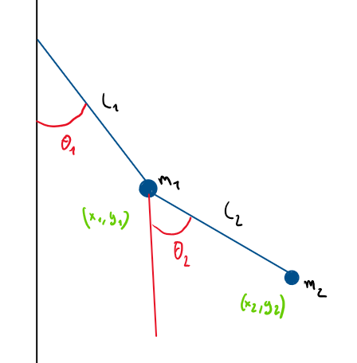

# Double pendule

## Notations

- $L_1, L_2$ : longueurs des bars
- $m_1, m_2$ : masses  
- $\theta_1, \theta_2$ : angles 
- $\dot{\theta}_1, \dot{\theta}_2$ : vitesses angulaires  
- $\ddot{\theta}_1, \ddot{\theta}_2$ : accélérations angulaires  
- $g$ : gravité 
- $c_1, c_2$ : frottement 

## Positions

$$x_1 = L_1 \sin \theta_1$$
$$y_1 = -L_1 \cos \theta_1$$
$$x_2 = x_1 + L_2 \sin \theta_2$$
$$y_2 = y_1 - L_2 \cos \theta_2$$

## Vitesses

$$\dot{x}_1 = \dot{\theta}_1 L_1 \cos \theta_1$$
$$\dot{y}_1 = \dot{\theta}_1 L_1 \sin \theta_1$$
$$\dot{x}_2 = \dot{x}_1 + \dot{\theta}_2 L_2 \cos \theta_2$$
$$\dot{y}_2 = \dot{y}_1 + \dot{\theta}_2 L_2 \sin \theta_2$$

## Accélérations

$$\ddot{x}_1 = -\dot{\theta}_1^2 L_1 \sin \theta_1 + \ddot{\theta}_1 L_1 \cos \theta_1$$
$$\ddot{y}_1 = \dot{\theta}_1^2 L_1 \cos \theta_1 + \ddot{\theta}_1 L_1 \sin \theta_1$$
$$\ddot{x}_2 = \ddot{x}_1 - \dot{\theta}_2^2 L_2 \sin \theta_2 + \ddot{\theta}_2 L_2 \cos \theta_2$$
$$\ddot{y}_2 = \ddot{y}_1 + \dot{\theta}_2^2 L_2 \cos \theta_2 + \ddot{\theta}_2 L_2 \sin \theta_2$$

## Équations du mouvement

$$\Delta = \theta_1 - \theta_2$$

### Accélération angulaire du premier pendule

$$\ddot{\theta}_1 = \frac{-g(2m_1 + m_2)\sin\theta_1 - m_2 g \sin(\theta_1 - 2\theta_2) - 2 m_2 \sin\Delta\left(\dot{\theta}_2^2 L_2 + \dot{\theta}_1^2 L_1 \cos\Delta\right)}{L_1 \left( 2m_1 + m_2 - m_2 \cos(2\Delta) \right)}$$

### Accélération angulaire du second pendule

$$\ddot{\theta}_2 = \frac{2 \sin\Delta\left(\dot{\theta}_1^2 L_1 (m_1+m_2) + g(m_1+m_2)\cos\theta_1 + \dot{\theta}_2^2 L_2 m_2 \cos\Delta\right)}{L_2 \left( 2m_1 + m_2 - m_2 \cos(2\Delta)\right)}$$

## Amortissement

$$\ddot{\theta}_1 \leftarrow \ddot{\theta}_1 - c_1 \dot{\theta}_1$$
$$\ddot{\theta}_2 \leftarrow \ddot{\theta}_2 - c_2 \dot{\theta}_2$$

# Runge-Kutta

---

## 1. Problème mathématique

Le système d’équations est :

$$
\begin{cases}
\dot{\theta}_1 = \omega_1 \\
\dot{\omega}_1 = f_1(\theta_1,\theta_2,\omega_1,\omega_2) \\
\dot{\theta}_2 = \omega_2 \\
\dot{\omega}_2 = f_2(\theta_1,\theta_2,\omega_1,\omega_2)
\end{cases}
$$

On regroupe ces variables dans un vecteur d’état :

$$
X(t) =
\begin{pmatrix}
\theta_1 \\
\omega_1 \\
\theta_2 \\
\omega_2
\end{pmatrix}
$$

L’objectif est de calculer l’état au temps suivant :

$$
X(t+\Delta t)
$$

---

## 2. Principe général de l’intégration temporelle

On connaît :
- l’état $X(t)$
- sa dérivée $\dot{X}(t)$

On approxime l’évolution sur un petit pas de temps $\Delta t$.

# Méthode de Runge–Kutta d’ordre 4 (RK4)

Au lieu d’utiliser une seule pente. RK4 utilise une moyenne pondérée de quatre pentes:

- pente au début du pas
- pente au milieu
- pente à la fin du pas

## Formule générale RK4

Pour une équation :

$$
\dot{X} = F(X)
$$

On définit :

$$
k_1 = F(X_n)
$$

$$
k_2 = F\left(X_n + \frac{\Delta t}{2}k_1\right)
$$

$$
k_3 = F\left(X_n + \frac{\Delta t}{2}k_2\right)
$$

$$
k_4 = F\left(X_n + \Delta t \, k_3\right)
$$

Puis :

$$
X_{n+1} = X_n + \frac{\Delta t}{6}
\left(
k_1 + 2k_2 + 2k_3 + k_4
\right)
$$

---

## 8. Application au double pendule

Le vecteur d’état est :

$$
X =
\begin{pmatrix}
\theta_1 \\
\omega_1 \\
\theta_2 \\
\omega_2
\end{pmatrix}
$$

La fonction dérivée est :

$$
F(X) =
\begin{pmatrix}
\omega_1 \\
\ddot{\theta}_1(\theta_1,\theta_2,\omega_1,\omega_2) \\
\omega_2 \\
\ddot{\theta}_2(\theta_1,\theta_2,\omega_1,\omega_2)
\end{pmatrix}
$$

Chaque $k_i$ est donc un **vecteur à 4 composantes**.

